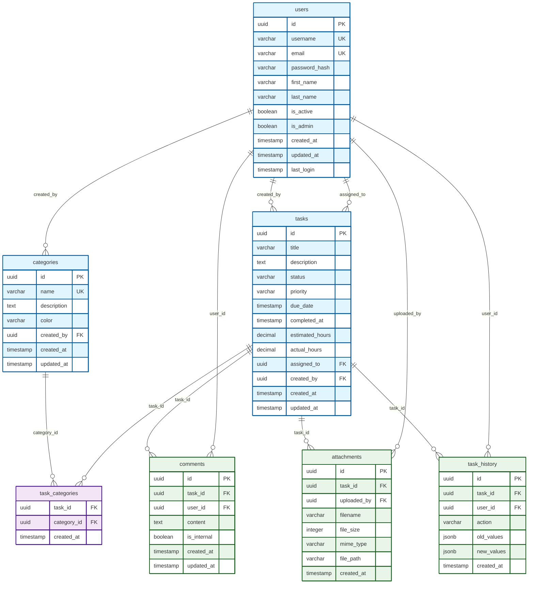

# Database Demo Setup

## 🗄️ Database Schema Overview

A comprehensive task management database with **7 tables** and multiple relationships demonstrating real-world database design patterns.

### 📊 Entity Relationship Diagram



### 📋 Tables & Relationships

#### **Core Entities**
- **`users`** - User accounts and authentication
- **`tasks`** - Main task management with status, priority, dates
- **`categories`** - Task categorization with colors
- **`comments`** - Task discussions and collaboration

#### **Relationship Tables**
- **`task_categories`** - Many-to-many: tasks ↔ categories
- **`attachments`** - File uploads linked to tasks
- **`task_history`** - Audit trail with JSONB change tracking

### 🔗 Relationship Types Demonstrated

| Relationship | Example | Type |
|-------------|---------|------|
| One-to-Many | `users` → `tasks` (assigned_to) | Foreign Key |
| One-to-Many | `users` → `tasks` (created_by) | Foreign Key |
| One-to-Many | `tasks` → `comments` | Foreign Key |
| Many-to-Many | `tasks` ↔ `categories` | Junction Table |
| One-to-Many | `tasks` → `attachments` | Foreign Key |
| One-to-Many | `tasks` → `task_history` | Foreign Key |

### ⚡ Advanced Features

- **UUID Primary Keys** with `uuid-ossp` extension
- **Check Constraints** for data validation (status, priority)
- **Performance Indexes** on frequently queried columns
- **Auto-Updating Timestamps** via triggers
- **Cascading Deletes** for data integrity
- **JSONB Columns** for flexible audit logging

## 🚀 Quick Commands

### Start Services
```bash
# Start Postgres
docker-compose up -d postgres

# Verify connection
python db_health.py
```

### Health Checks
```bash
# Basic connectivity
python db_health.py

# Full schema validation
python db_health_enhanced.py
```

### Explore Data
```bash
# Interactive queries
python demo_queries.py

# Direct psql access
PGPASSWORD=demo psql -h localhost -p 5432 -U demo -d demo
```

## 📊 Sample Data

### Users (4 records)
- **admin** (Admin User) - Administrator
- **john_doe** (John Doe) - Developer  
- **jane_smith** (Jane Smith) - Designer
- **bob_wilson** (Bob Wilson) - DevOps

### Tasks (5 records)
- Authentication implementation (John, High Priority, In Progress)
- Landing page design (Jane, Medium Priority, Pending)
- Navbar bug fix (Bob, Urgent Priority, Pending)
- API documentation (John, Low Priority, Completed)
- CI/CD pipeline setup (Bob, High Priority, In Progress)

### Categories (6 options)
- Development (#e74c3c)
- Design (#9b59b6)  
- Testing (#f39c12)
- Documentation (#2ecc71)
- Bug Fixes (#e67e22)
- Research (#3498db)

## 🎯 Educational Value

This schema demonstrates:
- ✅ Modern database design patterns
- ✅ Performance optimization techniques
- ✅ Data integrity enforcement
- ✅ Flexible audit tracking
- ✅ Complex query relationships
- ✅ Real-world application structure

Perfect for learning SQL, testing ORMs, or building GraphQL APIs! 