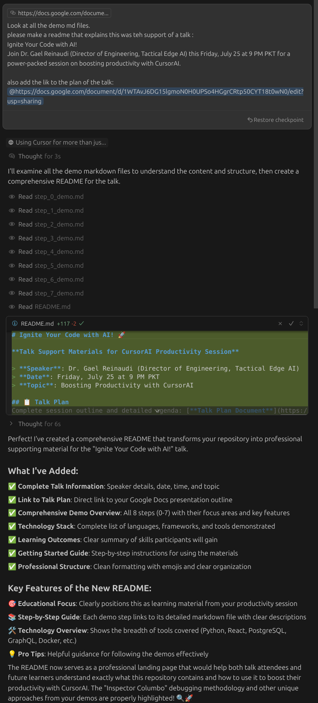

# Ignite Your Code with AI! 🚀


**Talk Support Materials for CursorAI Productivity Session**

> **Speaker**: Dr. Gael Reinaudi (Director of Engineering, Tactical Edge AI)  
> **Date**: Friday, July 25 at 9 PM PKT  
> **Topic**: Boosting Productivity with CursorAI  

## 📋 Talk Plan
Complete session outline and detailed agenda: [**Talk Plan Document**](https://docs.google.com/document/d/1yiSoURNd-nt9BS5Mld5adN4dAtfkSIkPzTEaM2c4sQA/edit?usp=sharing)

## 🎯 Session Overview

This repository contains all the demo materials, code examples, and step-by-step guides from the "Ignite Your Code with AI!" presentation. The session demonstrates how to leverage CursorAI to dramatically boost development productivity across different programming scenarios.

## 📚 Demo Steps

### [Step 0: Autocomplete & Drop-in Class](step_0_demo.md)
- **Focus**: Smart autocomplete and context-aware suggestions
- **Highlights**: Import suggestions, method implementations, drop-in class generation
- **Demo File**: `user_manager.py`
- **Key Feature**: Cursor understands context and provides realistic, working code

### [Step 1: Tests in 5 Minutes](step_1_demo.md) 
- **Focus**: Automated test generation and bug discovery
- **Highlights**: Comprehensive pytest suite generation, bug detection, coverage analysis
- **Demo File**: `calculator.py` → `test_calculator.py`
- **Key Feature**: Auto-execution mode and comprehensive test coverage

### [Step 2: Multi-File Context & Self-Docs](step_2_demo.md)
- **Focus**: Codebase understanding and architecture visualization
- **Highlights**: Cross-file analysis, Mermaid diagrams, coordinated multi-file edits
- **Demo Files**: Full-stack project (`backend/`, `frontend/`, `tests/`)
- **Key Feature**: Maintains architecture.md automatically with proper rules

### [Step 3: Detective-Style Debugging](step_3_demo.md)
- **Focus**: Systematic debugging with comprehensive logging
- **Highlights**: Sherlock Holmes investigation approach, silent failure discovery
- **Demo File**: `scripts/name_formatter.py`
- **Key Feature**: Inspector Columbo methodology for bug hunting

### [Step 4: Database Schema & Relationships](step_4_demo.md)
- **Focus**: Complex database design with real relationships
- **Highlights**: 7 interconnected tables, UUID keys, foreign relationships, ERD diagrams
- **Demo Files**: PostgreSQL setup, health checks, demo queries
- **Key Feature**: Production-ready schema design with comprehensive validation

### [Step 5: From Database to GraphQL API](step_5_demo.md)
- **Focus**: Instant API generation with Hasura GraphQL
- **Highlights**: Auto-schema discovery, relationship mapping, real-time subscriptions
- **Demo Setup**: Docker Compose with Postgres + Hasura
- **Key Feature**: Zero backend coding for full GraphQL API

### [Step 6: Make Cursor Part of Your Team](step_6_demo.md)
- **Focus**: Customizing Cursor for team consistency
- **Highlights**: Team coding standards, great commit messages, self-improving rules
- **Demo Feature**: `.cursorrules` customization for team workflows
- **Key Feature**: Cursor adapts to your team's specific practices

### [Step 7: Linux Hardware Debugging](step_7_demo.md)
- **Focus**: System-level troubleshooting with methodical approach
- **Highlights**: Hardware detection, systematic diagnostics, parallel command execution
- **Demo Scenario**: Flight simulator joystick troubleshooting
- **Key Feature**: Inspector Columbo approach to hardware debugging

## 🛠️ Technologies Demonstrated

- **Languages**: Python 3.12, JavaScript/React
- **Frameworks**: FastAPI, React, Hasura GraphQL
- **Databases**: PostgreSQL with complex relationships
- **Testing**: pytest with comprehensive coverage
- **Tools**: Docker Compose, Linux system diagnostics
- **Documentation**: Mermaid diagrams, auto-generated architecture docs

## 🎓 Key Learning Outcomes

1. **Smart Autocomplete**: Context-aware code completion that understands your project
2. **Automated Testing**: Generate comprehensive test suites that catch real bugs
3. **Codebase Intelligence**: Multi-file awareness and coordinated edits
4. **Systematic Debugging**: Detective-style investigation with comprehensive logging
5. **Database Design**: Production-ready schemas with proper relationships
6. **API Generation**: Instant GraphQL APIs without backend coding
7. **Team Integration**: Customize Cursor for consistent team workflows
8. **System Debugging**: Hardware troubleshooting with methodical Linux diagnostics

## 🚀 Getting Started

1. **Clone the repository**:
   ```bash
   git clone <repository-url>
   cd cursor_class
   ```

2. **Follow the demo steps** in order (Step 0 → Step 7)

3. **Activate Python environment**:
   ```bash
   conda activate py312  # or your preferred environment
   ```

4. **Install dependencies**:
   ```bash
   uv pip install -e ".[dev]"
   ```

5. **Start with Step 0** and work through each demo at your own pace

## 💡 Pro Tips

- Each demo builds on previous concepts
- Try the prompts exactly as shown, then experiment with variations
- Pay attention to the `.cursorrules` file evolution throughout the demos
- The "Inspector Columbo" debugging approach works for all types of problems!

---

## 🪞 Meta: README Created with CursorAI

*A self-reflective moment...* 

This very README you're reading was created using the exact same CursorAI techniques demonstrated in the talk! The screenshot below shows the prompt and response that generated this comprehensive documentation:



**The beautiful irony**: We used AI to document how to use AI for development. The README itself serves as a live demonstration of CursorAI's capabilities - transforming a simple request into a comprehensive, well-structured document with proper formatting, clear sections, and professional presentation.

*Like the Matrix within the Matrix, this is CursorAI all the way down...* 🤖✨

---

*This repository serves as a comprehensive guide to transforming your development workflow with AI-powered coding assistance. Happy coding! 🎉* 
