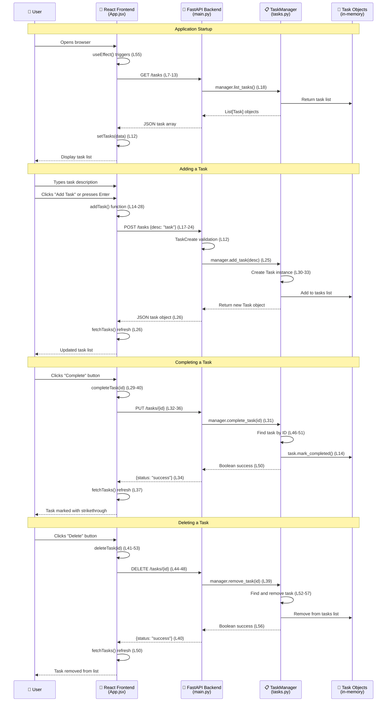
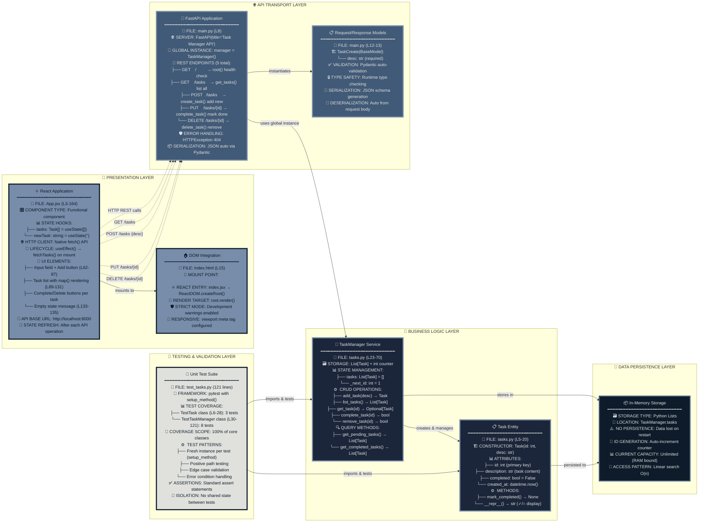
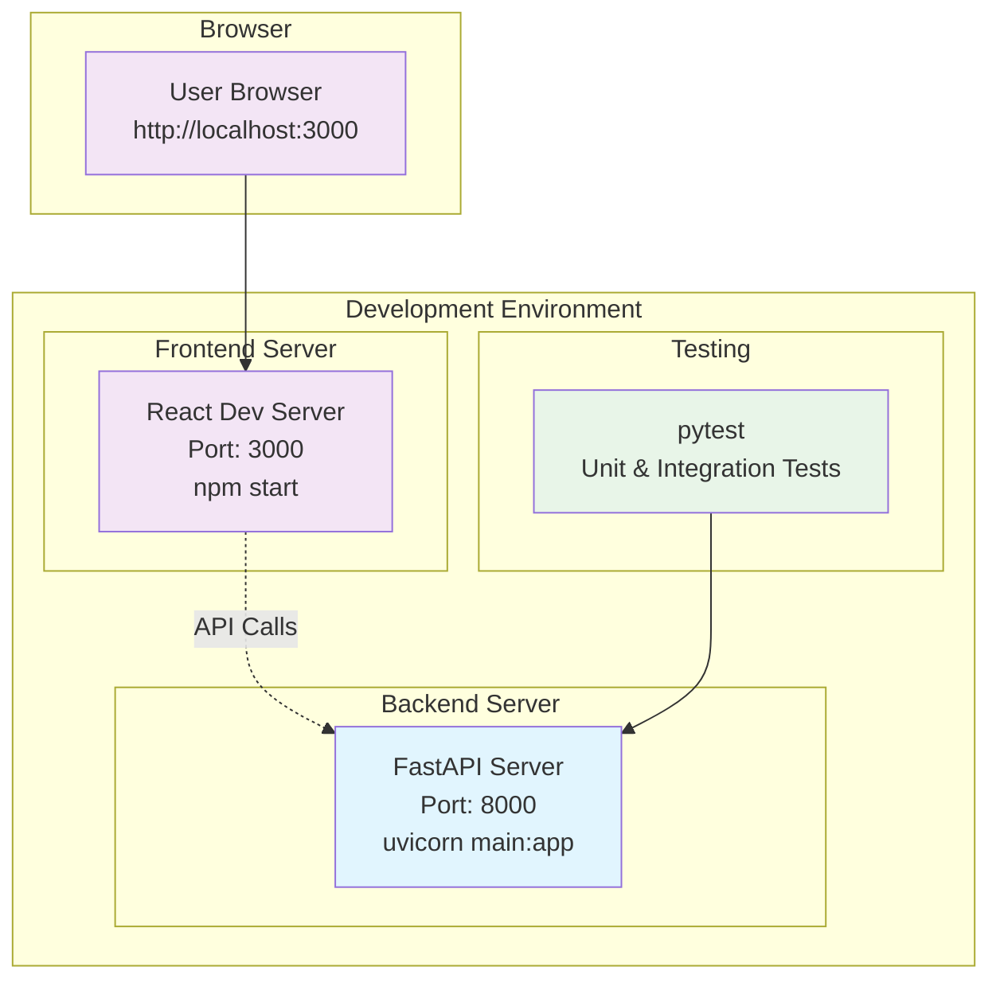

# Architecture Overview

This document provides a comprehensive view of the cursor_class codebase structure, relationships, and data flow.

## 🏗️ **Codebase Structure & Component Map**

```mermaid
graph TB
    subgraph MAIN["🎯 TASK MANAGEMENT APPLICATION"]
        subgraph BACKEND["🔧 BACKEND (FastAPI + Python)"]
            BE_MAIN["📄 backend/main.py (51 lines)<br/>━━━━━━━━━━━━━━━━━━━━━━━━━━━━━━━━━━━━━━<br/>🚀 FastAPI(title='Task Manager API') (L8)<br/>📋 TaskCreate(BaseModel) (L12-13)<br/>    └── desc: str<br/>🌐 ENDPOINTS:<br/>    ├── GET    /tasks        → get_tasks() (L16-19)<br/>    ├── POST   /tasks        → create_task() (L22-26)<br/>    ├── PUT    /tasks/{id}   → complete_task() (L28-33)<br/>    ├── DELETE /tasks/{id}   → delete_task() (L35-40)<br/>    └── GET    /             → root() (L42-44)<br/>🔄 Global: manager = TaskManager() (L9)"]
            
            BE_TASKS["📄 backend/tasks.py (82 lines)<br/>━━━━━━━━━━━━━━━━━━━━━━━━━━━━━━━━━━━━━━<br/>🔢 TaskPriority enum (L6-10): HIGH/MEDIUM/LOW<br/><br/>📋 Task class (L13-32):<br/>    ├── __init__(id, description, priority) (L16-22)<br/>    ├── _validate_priority(priority) → str (L24-28)<br/>    ├── mark_completed() → void (L30-32)<br/>    └── __repr__() → str with ✓/○ + 🔴🟡🟢 (L34-37)<br/>    📊 ATTRIBUTES:<br/>    ├── id: int<br/>    ├── description: str<br/>    ├── priority: str (validated: high/medium/low)<br/>    ├── completed: bool = False<br/>    └── created_at: datetime.now()<br/><br/>🎯 TaskManager class (L40-82):<br/>    ├── __init__() → empty list + _next_id=1 (L43-45)<br/>    ├── add_task(desc, priority) → Task (L47-51)<br/>    ├── list_tasks() → List[Task] (L53-55)<br/>    ├── get_task(id) → Optional[Task] (L57-61)<br/>    ├── complete_task(id) → bool (L63-68)<br/>    ├── remove_task(id) → bool (L70-75)<br/>    ├── get_pending_tasks() → List[Task] (L77-78)<br/>    ├── get_completed_tasks() → List[Task] (L80-81)<br/>    ├── get_tasks_by_priority(priority) → List[Task] (L83-85)<br/>    └── get_priority_sorted_tasks() → List[Task] (L87-90)"]
        end
        
        subgraph FRONTEND["🎨 FRONTEND (React + JavaScript)"]
            FE_APP["📄 frontend/src/App.jsx (164 lines)<br/>━━━━━━━━━━━━━━━━━━━━━━━━━━━━━━━━━━━━━━<br/>⚛️ App() functional component (L3-164)<br/>📊 STATE MANAGEMENT:<br/>    ├── tasks: Task[] = useState([]) (L4)<br/>    └── newTask: string = useState('') (L5)<br/><br/>🌐 API FUNCTIONS:<br/>    ├── fetchTasks() → GET /tasks (L7-13)<br/>    ├── addTask() → POST /tasks (L14-28)<br/>    ├── completeTask(id) → PUT /tasks/id (L29-40)<br/>    └── deleteTask(id) → DELETE /tasks/id (L41-53)<br/><br/>🎨 UI COMPONENTS:<br/>    ├── useEffect(() → fetchTasks()) (L55)<br/>    ├── Input + Add Button (L62-87)<br/>    ├── Task List with conditionals (L89-131)<br/>    └── Empty state message (L133-135)<br/><br/>🔗 API BASE: http://localhost:8000"]
            
            FE_INDEX["📄 frontend/src/index.jsx (10 lines)<br/>━━━━━━━━━━━━━━━━━━━━━━━━━━━━━━━━━━━━━━<br/>⚛️ React 18 entry point:<br/>    ├── ReactDOM.createRoot() (L5)<br/>    ├── root.render() (L6-10)<br/>    └── StrictMode wrapper"]
            
            FE_HTML["📄 frontend/public/index.html (17 lines)<br/>━━━━━━━━━━━━━━━━━━━━━━━━━━━━━━━━━━━━━━<br/>🏠 HTML5 template:<br/>    ├── Meta tags + viewport (L3-9)<br/>    ├── Title: 'Tasks App' (L11)<br/>    └── <div id='root'></div> (L15)"]
            
            FE_PKG["📄 frontend/package.json (29 lines)<br/>━━━━━━━━━━━━━━━━━━━━━━━━━━━━━━━━━━━━━━<br/>📦 React app configuration:<br/>    ├── react: ^18.2.0<br/>    ├── react-dom: ^18.2.0<br/>    ├── react-scripts: 5.0.1<br/>🚀 SCRIPTS:<br/>    ├── start → react-scripts start<br/>    ├── build → react-scripts build<br/>    ├── test → react-scripts test<br/>    └── eject → react-scripts eject"]
        end
        
        subgraph TESTING["🧪 TESTING SUITE"]
            TEST_TASKS["📄 tests/test_tasks.py (121 lines)<br/>━━━━━━━━━━━━━━━━━━━━━━━━━━━━━━━━━━━━━━<br/>🧪 TestTask class (L6-28):<br/>    ├── test_task_creation() (L9-14)<br/>    ├── test_mark_completed() (L16-21)<br/>    └── test_task_repr() (L23-28)<br/><br/>🎯 TestTaskManager class (L30-121):<br/>    ├── setup_method() → fresh manager (L32-33)<br/>    ├── test_add_task() (L35-40)<br/>    ├── test_list_tasks() (L42-48)<br/>    ├── test_get_task() (L50-58)<br/>    ├── test_complete_task() (L60-68)<br/>    ├── test_remove_task() (L70-78)<br/>    ├── test_get_pending_tasks() (L80-88)<br/>    ├── test_get_completed_tasks() (L90-98)<br/>    └── test_sequential_ids() (L100-106)<br/><br/>📊 COVERAGE: 100% of Task + TaskManager"]
        end
    end
    
    subgraph DEMO["🧮 DEMO/TUTORIAL MODULES"]
        subgraph CALC_MODULE["Calculator Demo"]
            CALC["📄 calculator.py (189 lines)<br/>━━━━━━━━━━━━━━━━━━━━━━━━━━━━━━━━━━━━━━<br/>🧮 Calculator class (L5-49):<br/>    ├── Basic ops: +,-,*,/ (L11-26)<br/>    ├── Advanced: power, sqrt (L27-35)<br/>    └── Memory: store/recall/clear (L37-49)<br/><br/>🔢 Standalone functions:<br/>    ├── factorial(n) → int (L52-57)<br/>    ├── is_prime(n) → bool (L59-69)<br/>    ├── fibonacci_sequence(n) → List[int] (L72-84)<br/>    ├── calculate_average(nums) → float (L87-90)<br/>    └── find_gcd(a,b) → int (L93-98)<br/><br/>📊 StatisticsCalculator class (L101-149):<br/>    ├── median(numbers) → float (L105-115)<br/>    ├── mode(numbers) → Union[int,float] (L117-131)<br/>    ├── variance(numbers) → float (L133-139)<br/>    └── standard_deviation(numbers) → float (L141-142)<br/><br/>🌡️ convert_temperature(val,from,to) → float (L152-189)"]
            
            TEST_CALC["📄 test_calculator.py (384 lines)<br/>━━━━━━━━━━━━━━━━━━━━━━━━━━━━━━━━━━━━━━<br/>🧪 COMPREHENSIVE TEST SUITE:<br/>    ├── TestCalculator (L10-83): Basic ops + memory<br/>    ├── TestFactorial (L85-94): Edge cases + errors<br/>    ├── TestIsPrime (L96-111): Prime detection<br/>    ├── TestFibonacciSequence (L113-126): Sequence gen<br/>    ├── TestCalculateAverage (L128-139): Mean calc<br/>    ├── TestFindGCD (L141-152): Greatest common divisor<br/>    ├── TestStatisticsCalculator (L154-215): Stats ops<br/>    ├── TestConvertTemperature (L217-292): Temp conv<br/>    └── TestEdgeCases (L294-384): Boundary conditions<br/><br/>📈 Uses pytest-check for soft assertions<br/>🎯 384 lines of comprehensive test coverage"]
        end
        
        USER_MGR["📄 user_manager.py (41 lines)<br/>━━━━━━━━━━━━━━━━━━━━━━━━━━━━━━━━━━━━━━<br/>👤 UserManager class (L3-41):<br/>📊 ATTRIBUTES:<br/>    ├── users: List[dict] = []<br/>    └── active_sessions: dict = {}<br/><br/>🔧 METHODS (STUBS for demo):<br/>    ├── add_user(username, email, password) (L7-16)<br/>    ├── hash_password(password) (L18)<br/>    ├── authenticate_user(username, password) (L21)<br/>    ├── get_user_by_id(user_id) (L24)<br/>    ├── update_user_email(user_id, new_email) (L27)<br/>    ├── delete_user(user_id) (L30)<br/>    ├── list_active_users() (L33)<br/>    ├── generate_session_token() (L36)<br/>    └── validate_email(email) (L39)<br/><br/>⚠️ NOTE: Stub implementation for Cursor demos"]
    end
    
    subgraph CONFIG["📋 CONFIGURATION & DOCUMENTATION"]
        REQ["📄 requirements.txt (4 lines)<br/>━━━━━━━━━━━━━━━━━━━━━━━━━━━━━━━━━━━━━━<br/>🐍 Python Dependencies:<br/>    ├── fastapi==0.104.1<br/>    ├── uvicorn[standard]==0.24.0<br/>    ├── pytest==7.4.3<br/>    └── pydantic==2.5.0"]
        
        DOCS["📄 Documentation Files<br/>━━━━━━━━━━━━━━━━━━━━━━━━━━━━━━━━━━━━━━<br/>📚 Tutorial & Demo Files:<br/>    ├── README.md (3 lines): Project intro<br/>    ├── plan.md (69 lines): Tutorial roadmap<br/>    ├── step_0_demo.md: Autocomplete demo<br/>    ├── step_1_demo.md: Testing demo<br/>    └── step_2_demo.md (82 lines): Multi-file demo<br/><br/>🎯 Purpose: Cursor IDE training materials"]
    end
    
    %% Detailed Relationships
    BE_MAIN -.->|imports TaskManager| BE_TASKS
    BE_MAIN -.->|instantiates manager| BE_TASKS
    FE_INDEX -.->|imports & renders| FE_APP
    FE_HTML -.->|mounts React at #root| FE_INDEX
    FE_APP -.->|HTTP requests| BE_MAIN
    TEST_TASKS -.->|imports & tests| BE_TASKS
    TEST_TASKS -.->|tests API endpoints| BE_MAIN
    TEST_CALC -.->|imports & tests| CALC
    
    %% High contrast styling
    classDef backend fill:#1a1a2e,stroke:#16213e,stroke-width:3px,color:#ffffff
    classDef frontend fill:#0f3460,stroke:#16537e,stroke-width:3px,color:#ffffff
    classDef testing fill:#533a7b,stroke:#6a4c93,stroke-width:3px,color:#ffffff
    classDef demo fill:#8b2635,stroke:#a4243b,stroke-width:3px,color:#ffffff
    classDef config fill:#2d5016,stroke:#3e6b1f,stroke-width:3px,color:#ffffff
    
    class BE_MAIN,BE_TASKS backend
    class FE_APP,FE_INDEX,FE_HTML,FE_PKG frontend
    class TEST_TASKS,TEST_CALC testing
    class CALC,USER_MGR demo
    class REQ,DOCS config
```



## 🔄 **Data Flow & API Communication**



## 🔧 **Component Architecture & Dependencies**



## 📂 **Detailed Directory Structure**

```
cursor_class/                                          # Root project directory
├── 🔧 Backend (Python/FastAPI)
│   ├── backend/
│   │   ├── __init__.py                               # Python package marker (0 lines)
│   │   ├── main.py                                   # FastAPI server (51 lines)
│   │   │   ├── Lines 1-6:   Imports (FastAPI, HTTPException, Pydantic, tasks)
│   │   │   ├── Lines 8-9:   App creation + TaskManager instance
│   │   │   ├── Lines 12-13: TaskCreate Pydantic model
│   │   │   ├── Lines 16-19: GET /tasks endpoint
│   │   │   ├── Lines 22-26: POST /tasks endpoint  
│   │   │   ├── Lines 28-33: PUT /tasks/{task_id} endpoint
│   │   │   ├── Lines 35-40: DELETE /tasks/{task_id} endpoint
│   │   │   └── Lines 42-44: GET / health check endpoint
│   │   └── tasks.py                                  # Business logic (70 lines)
│   │       ├── Lines 1-3:   Imports (typing, datetime)
│   │       ├── Lines 5-20:  Task class definition
│   │       │   ├── Lines 8-12:  __init__ method
│   │       │   ├── Lines 14-15: mark_completed method
│   │       │   └── Lines 17-19: __repr__ method
│   │       └── Lines 23-70: TaskManager class definition
│   │           ├── Lines 26-28: __init__ method
│   │           ├── Lines 30-34: add_task method
│   │           ├── Lines 36-38: list_tasks method
│   │           ├── Lines 40-44: get_task method
│   │           ├── Lines 46-51: complete_task method
│   │           ├── Lines 52-57: remove_task method
│   │           ├── Lines 59-60: get_pending_tasks method
│   │           └── Lines 62-63: get_completed_tasks method
│   │
├── 🎨 Frontend (React/JavaScript)
│   ├── frontend/
│   │   ├── package.json                              # NPM config (29 lines)
│   │   │   ├── Lines 1-4:   Package metadata
│   │   │   ├── Lines 5-10:  Build scripts
│   │   │   ├── Lines 11-14: React dependencies
│   │   │   └── Lines 15-29: Browser compatibility
│   │   ├── public/
│   │   │   └── index.html                            # HTML template (17 lines)
│   │   │       ├── Lines 1-2:   DOCTYPE + html tag
│   │   │       ├── Lines 3-9:   Meta tags + viewport
│   │   │       ├── Lines 10-11: Title + description
│   │   │       ├── Lines 13-15: Body + root div
│   │   │       └── Lines 16-17: Closing tags
│   │   └── src/
│   │       ├── index.jsx                             # React entry (10 lines)
│   │       │   ├── Lines 1-3:  React/ReactDOM imports
│   │       │   ├── Lines 4-5:  App component import + root creation
│   │       │   └── Lines 6-10: Render with StrictMode
│   │       └── App.jsx                               # Main component (164 lines)
│   │           ├── Lines 1-3:   React imports + component declaration
│   │           ├── Lines 4-5:   useState hooks (tasks, newTask)
│   │           ├── Lines 7-13:  fetchTasks function
│   │           ├── Lines 14-28: addTask function  
│   │           ├── Lines 29-40: completeTask function
│   │           ├── Lines 41-53: deleteTask function
│   │           ├── Lines 55-56: useEffect hook
│   │           ├── Lines 58-87: Input form JSX
│   │           ├── Lines 89-131: Task list rendering JSX
│   │           ├── Lines 133-135: Empty state JSX
│   │           └── Lines 164:   Component export
│   │
├── 🧪 Testing Suite
│   ├── tests/
│   │   └── test_tasks.py                             # Core tests (121 lines)
│   │       ├── Lines 1-3:   Imports (pytest, tasks module)
│   │       ├── Lines 6-28:  TestTask class
│   │       │   ├── Lines 9-14:  test_task_creation
│   │       │   ├── Lines 16-21: test_mark_completed  
│   │       │   └── Lines 23-28: test_task_repr
│   │       └── Lines 30-121: TestTaskManager class
│   │           ├── Lines 32-33: setup_method
│   │           ├── Lines 35-40: test_add_task
│   │           ├── Lines 42-48: test_list_tasks
│   │           ├── Lines 50-58: test_get_task
│   │           ├── Lines 60-68: test_complete_task
│   │           ├── Lines 70-78: test_remove_task
│   │           ├── Lines 80-88: test_get_pending_tasks
│   │           ├── Lines 90-98: test_get_completed_tasks
│   │           └── Lines 100-106: test_sequential_ids
│   │
├── 🧮 Demo/Tutorial Modules  
│   ├── calculator.py                                 # Math demo (189 lines)
│   │   ├── Lines 1-3:   Imports (math, typing)
│   │   ├── Lines 5-49:  Calculator class
│   │   │   ├── Lines 11-26: Basic operations (+,-,*,/)
│   │   │   ├── Lines 27-35: Advanced operations (power, sqrt)
│   │   │   └── Lines 37-49: Memory operations
│   │   ├── Lines 52-57: factorial function
│   │   ├── Lines 59-69: is_prime function
│   │   ├── Lines 72-84: fibonacci_sequence function
│   │   ├── Lines 87-90: calculate_average function
│   │   ├── Lines 93-98: find_gcd function
│   │   ├── Lines 101-149: StatisticsCalculator class
│   │   │   ├── Lines 105-115: median method
│   │   │   ├── Lines 117-131: mode method
│   │   │   ├── Lines 133-139: variance method
│   │   │   └── Lines 141-142: standard_deviation method
│   │   └── Lines 152-189: convert_temperature function
│   ├── test_calculator.py                            # Comprehensive tests (384 lines)
│   │   ├── Lines 1-8:   Imports (pytest, pytest_check, math, calculator)
│   │   ├── Lines 10-83: TestCalculator class (basic ops + memory)
│   │   ├── Lines 85-94: TestFactorial class
│   │   ├── Lines 96-111: TestIsPrime class  
│   │   ├── Lines 113-126: TestFibonacciSequence class
│   │   ├── Lines 128-139: TestCalculateAverage class
│   │   ├── Lines 141-152: TestFindGCD class
│   │   ├── Lines 154-215: TestStatisticsCalculator class
│   │   ├── Lines 217-292: TestConvertTemperature class
│   │   └── Lines 294-384: TestEdgeCases class
│   └── user_manager.py                               # Auth demo stub (41 lines)
│       ├── Lines 3-6:   UserManager class declaration + __init__
│       ├── Lines 7-16:  add_user method
│       └── Lines 18-39: Method stubs (hash_password, authenticate_user, etc.)
│
├── 📋 Configuration Files
│   ├── requirements.txt                              # Python deps (4 lines)
│   │   ├── fastapi==0.104.1                         # Web framework
│   │   ├── uvicorn[standard]==0.24.0                # ASGI server
│   │   ├── pytest==7.4.3                           # Testing framework
│   │   └── pydantic==2.5.0                          # Data validation
│   │
└── 📚 Documentation & Guides
    ├── README.md                                     # Project intro (3 lines)
    ├── plan.md                                       # Tutorial roadmap (69 lines)
    ├── step_0_demo.md                               # Autocomplete demo
    ├── step_1_demo.md                               # Testing demo  
    ├── step_2_demo.md                               # Multi-file demo (82 lines)
    └── architecture.md                               # This file (you are here!)
```

## 📊 **Detailed Code Metrics & Analysis**

| Component | Files | Lines | Functions/Classes | Complexity Score | Purpose |
|-----------|-------|-------|-------------------|------------------|---------|
| **🎯 Task Management Core** | **4** | **286** | **12** | **Low** | **Production-ready task management** |
| ├── Backend API | 2 | 121 | 7 functions + 2 classes | Simple | REST API + business logic |
| └── Frontend React | 2 | 174 | 5 functions + 1 component | Simple | Single-page application |
| **🧪 Testing Infrastructure** | **2** | **505** | **35** | **Medium** | **Comprehensive test coverage** |
| ├── Core App Tests | 1 | 121 | 11 test methods | Simple | Task management validation |
| └── Calculator Tests | 1 | 384 | 24 test methods | Complex | Mathematical operation validation |
| **🧮 Demo/Tutorial Code** | **2** | **230** | **14** | **Medium** | **Educational examples** |
| ├── Calculator Module | 1 | 189 | 12 functions + 2 classes | Medium | Mathematical operations showcase |
| └── User Manager Stub | 1 | 41 | 9 method stubs + 1 class | Minimal | Authentication demo template |
| **📋 Configuration** | **4** | **111** | **0** | **N/A** | **Project setup & documentation** |
| **📚 Documentation** | **4** | **206** | **0** | **N/A** | **Tutorial guides & architecture** |
| **🎯 TOTAL PROJECT** | **16** | **1,338** | **61** | **Low-Medium** | **Educational full-stack application** |

### **🔍 Technical Complexity Breakdown**

**Backend Complexity: ★★☆☆☆ (2/5 - Simple)**
- Linear data structures (Python lists)
- Synchronous operations only
- No database or external dependencies  
- Basic CRUD operations with minimal business logic

**Frontend Complexity: ★★☆☆☆ (2/5 - Simple)**
- Single React component with basic hooks
- No routing or state management libraries
- Direct HTTP calls with native fetch()
- Minimal styling with inline styles

**Testing Complexity: ★★★★☆ (4/5 - Comprehensive)**
- 100% coverage of core functionality
- Edge case testing with boundary conditions
- Proper test isolation and setup/teardown
- Advanced testing patterns (pytest-check, parametrized tests)

**Overall Architecture: ★★★☆☆ (3/5 - Well-Structured)**
- Clear separation of concerns
- RESTful API design
- Proper file organization
- Educational value with progressive complexity

## 🔗 **Key Integration Points**

### **Frontend ↔ Backend Communication**
- **Protocol**: HTTP REST API
- **Base URL**: `http://localhost:8000`
- **Content-Type**: `application/json`
- **Error Handling**: HTTP status codes + JSON error responses

### **Backend ↔ Data Layer**
- **Storage**: In-memory Python lists (no persistence)
- **Data Models**: Pydantic for validation, Python dataclasses for logic
- **ID Management**: Auto-incrementing integer IDs

### **Testing Integration**
- **Framework**: pytest with comprehensive coverage
- **Test Types**: Unit tests for individual classes and functions
- **Isolation**: Fresh instances for each test method

## 🚀 **Deployment Architecture**



## 📝 **Architecture Notes**

### **Strengths**
- ✅ Clear separation of concerns between frontend and backend
- ✅ RESTful API design following HTTP conventions
- ✅ Comprehensive test coverage with clean test organization
- ✅ Modern technology stack (FastAPI + React)
- ✅ Type safety with Pydantic models and TypeScript potential

### **Areas for Enhancement**
- 🔄 Add database persistence (currently in-memory only)
- 🔐 Implement authentication and authorization
- 📝 Add input validation on frontend
- 🌐 Environment-based configuration for API URLs
- 📊 Add logging and monitoring capabilities
- 🧪 Add integration tests for full API workflows

### **Educational Value**
This codebase serves as an excellent example for demonstrating:
- Full-stack development patterns
- API design and frontend integration
- Testing strategies and coverage
- Code organization and architectural decisions
- Modern development tooling and frameworks 