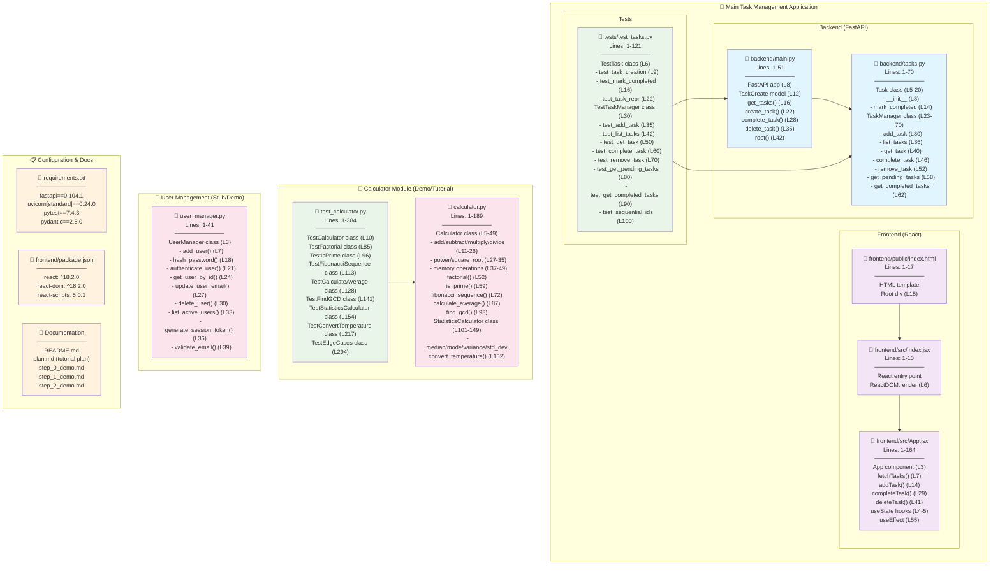
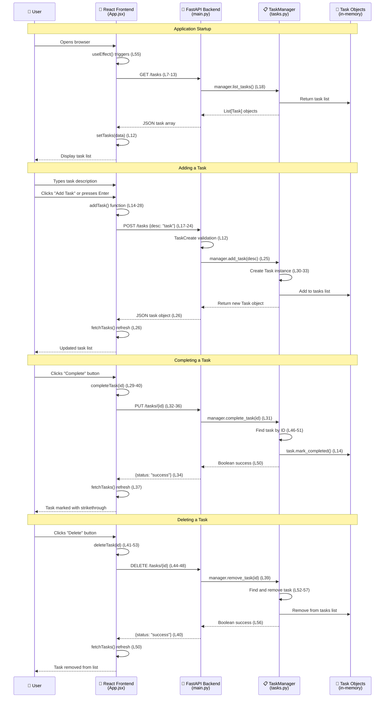
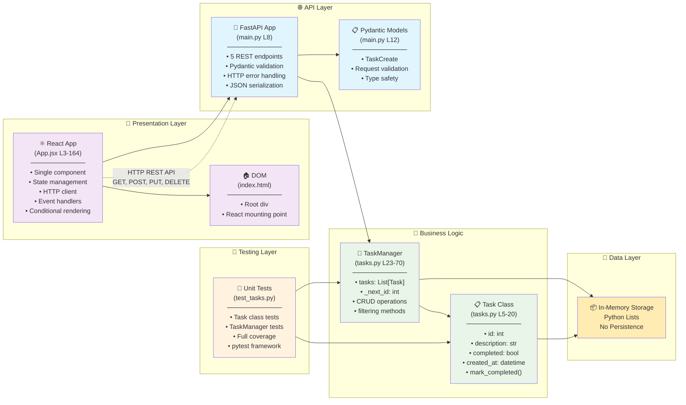
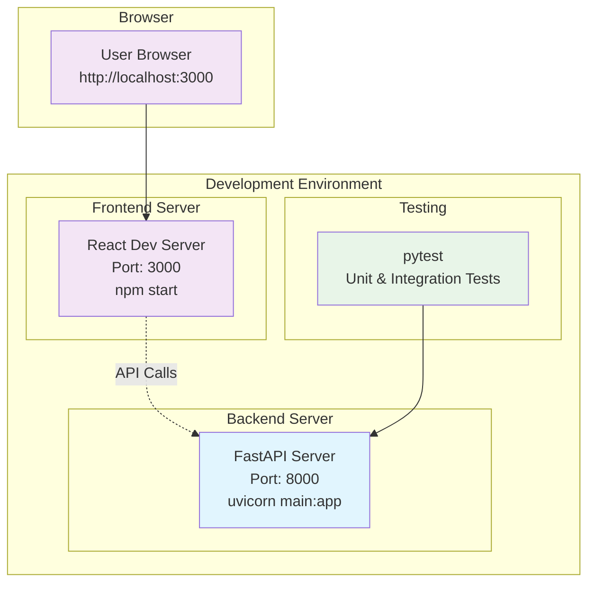

# Architecture Overview

This document provides a comprehensive view of the cursor_class codebase structure, relationships, and data flow.

## 🏗️ **Codebase Structure & Component Map**

## 🔄 **Data Flow & API Communication**

## 🔧 **Component Architecture & Dependencies**

## 📊 **File Statistics & Code Distribution**

| Component | Files | Lines | Purpose |
|-----------|-------|-------|---------|
| **Task Management Core** | 4 | 286 | Main application logic |
| - Backend API | 2 | 121 | FastAPI server + business logic |
| - Frontend React | 2 | 174 | User interface |
| **Testing** | 2 | 505 | Test coverage |
| - Task Tests | 1 | 121 | Unit tests for core functionality |
| - Calculator Tests | 1 | 384 | Comprehensive test suite |
| **Demo Components** | 2 | 230 | Tutorial/demo code |
| - Calculator Module | 1 | 189 | Mathematical operations |
| - User Manager | 1 | 41 | Stub implementation |
| **Configuration** | 4 | 111 | Project setup |
| **Documentation** | 4 | 206 | Guides and tutorials |
| **Total** | **16** | **1,338** | Complete codebase |

## 🔗 **Key Integration Points**

### **Frontend ↔ Backend Communication**
- **Protocol**: HTTP REST API
- **Base URL**: `http://localhost:8000`
- **Content-Type**: `application/json`
- **Error Handling**: HTTP status codes + JSON error responses

### **Backend ↔ Data Layer**
- **Storage**: In-memory Python lists (no persistence)
- **Data Models**: Pydantic for validation, Python dataclasses for logic
- **ID Management**: Auto-incrementing integer IDs

### **Testing Integration**
- **Framework**: pytest with comprehensive coverage
- **Test Types**: Unit tests for individual classes and functions
- **Isolation**: Fresh instances for each test method

## 🚀 **Deployment Architecture**

## 📝 **Architecture Notes**

### **Strengths**
- ✅ Clear separation of concerns between frontend and backend
- ✅ RESTful API design following HTTP conventions
- ✅ Comprehensive test coverage with clean test organization
- ✅ Modern technology stack (FastAPI + React)
- ✅ Type safety with Pydantic models and TypeScript potential

### **Areas for Enhancement**
- 🔄 Add database persistence (currently in-memory only)
- 🔐 Implement authentication and authorization
- 📝 Add input validation on frontend
- 🌐 Environment-based configuration for API URLs
- 📊 Add logging and monitoring capabilities
- 🧪 Add integration tests for full API workflows

### **Educational Value**
This codebase serves as an excellent example for demonstrating:
- Full-stack development patterns
- API design and frontend integration
- Testing strategies and coverage
- Code organization and architectural decisions
- Modern development tooling and frameworks 